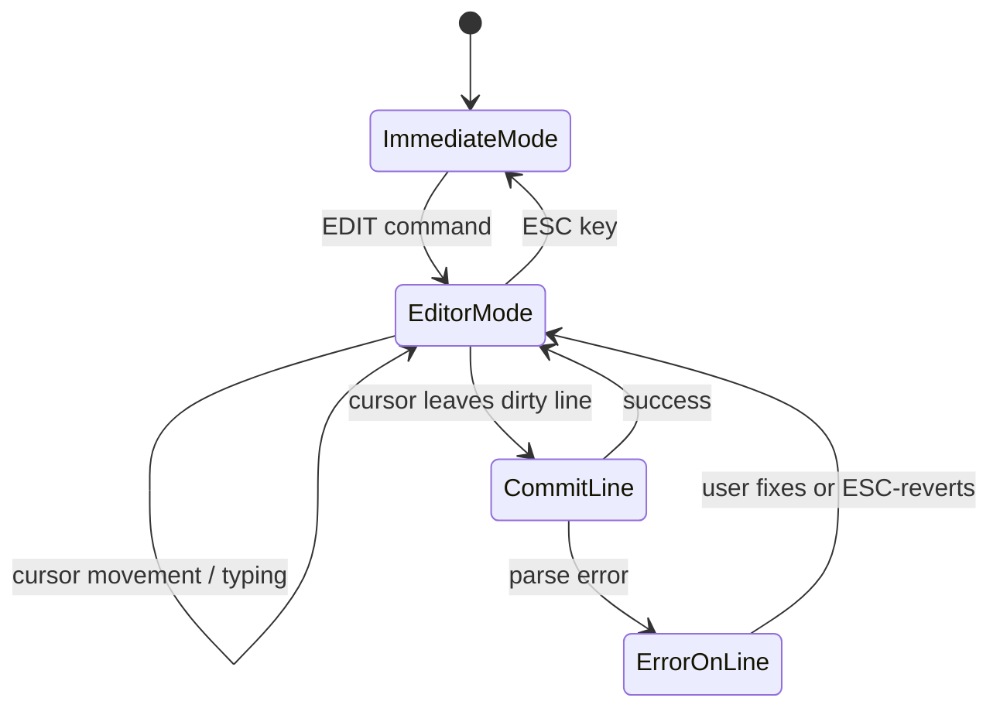

# VC83 BASIC Full-Screen Editor Plan

## Overview

This document proposes adding an optional full-screen program editor to VC83 BASIC. The editor would be a distinct UI mode from the existing immediate-mode REPL, allowing users to view and edit multiple program lines on screen simultaneously with cursor movement.

---

## 1. Current Architecture Summary

### Program Line Storage

Lines are stored sequentially in memory using the [`Line`](file:///Users/wboyce/git/vc83basic/src/basic.s#L27-L31) struct:

```
.struct Line
    next_line_offset .res 1    ; byte offset to next line (max 255)
    number .res 2              ; 16-bit line number (little-endian)
    ; ...followed by statement data...
.endstruct
```

Lines are kept **sorted by line number** in program memory. The program is terminated by a sentinel null line (`next_line_offset=0, number=$FFFF`). Multiple lines **can** share the same line number — `find_line` returns the first match. This property is central to the editor design.

### Tokenization Pipeline

1. User types text into `buffer` (256 bytes)
2. [`parse_line`](file:///Users/wboyce/git/vc83basic/src/parser.s#L22-L65) tokenizes into `line_buffer` (256 bytes), parsing the line number (or setting it to $FFFF if absent)
3. The REPL in [`main.s`](file:///Users/wboyce/git/vc83basic/src/main.s#L89-L102) checks `line_buffer+Line::number+1`: if negative → immediate mode; if positive → calls [`insert_or_update_line`](file:///Users/wboyce/git/vc83basic/src/program.s#L151-L186) to store it

### De-tokenization (LIST)

[`list_line`](file:///Users/wboyce/git/vc83basic/src/list.s#L58-L82) reads from a line at `line_ptr` and renders it into `buffer`, including the line number and all statements. [`list_statement`](file:///Users/wboyce/git/vc83basic/src/list.s#L86-L152) handles expanding keywords, names, numbers, and strings.

### Size Constraints

| Target | Current Size | Budget |
|--------|-------------|--------|
| apple2 | 8,152 ($1FD8) | 8,192 (8K) |
| apple2_lc | 8,676 ($21E4) | ~12K |
| atari | 9,157 ($23C5) | ~12K |
| ac6502 | 9,451 ($24EB) | ~16K |
| sim6502 | 11,453 ($2CBD) | no hard limit |

> [!CAUTION]
> The `apple2` target has only **40 bytes free**. The editor **cannot** fit in the core binary. It must be a platform extension.

---

## 2. Line Number Model: Duplicate Line Numbers

The editor uses a design that exploits an existing property of VC83 BASIC: multiple lines can share the same line number. Rather than introducing labels or auto-renumbering, the editor treats consecutive lines with the same number as a **group**.

### How It Works

**Inserting a line:** When the user inserts a new line in the editor, it receives the same line number as the line above it (or 0 if there is no line above). The new line is stored in program memory immediately after the current line.

**Display:** The editor (and LIST) show the line number only on the **first** line of each group. Continuation lines are displayed with a blank line number field:

```
5 PRINT "A"
10 PRINT "B"
   PRINT "C"
   PRINT "D"
20 PRINT "E"
```

Here, PRINT "C" and PRINT "D" are also line 10 internally, but the number is suppressed in display.

**GOTO/GOSUB:** `GOTO 10` finds the first line 10 (PRINT "B") via `find_line`, which already returns the first match. Execution proceeds sequentially through the group. No changes needed.

**Editor deletion:** Deleting any line in the editor removes just that one physical line. If the first line of a group (the one showing the number) is deleted, the next line in the group is now first and its number becomes visible — automatically, since it already carries the same number.

**REPL deletion:** Typing a bare `10` at the REPL deletes **all** lines numbered 10. This is a small change to [`insert_or_update_line`](file:///Users/wboyce/git/vc83basic/src/program.s#L151-L186): loop the find-and-shrink until no more matches.

**REPL replacement:** Typing `10 PRINT "X"` at the REPL deletes all existing line 10s and inserts the new one. Same loop mechanism — delete all, then insert.

### Why This Works

- **No renumbering ever needed.** Insertions and deletions never change any line's number.
- **No new token types.** No labels, no new syntax.
- **GOTO/GOSUB unchanged.** `find_line` already returns the first match.
- **FOR/NEXT, GOSUB/RETURN unchanged.** These use `next_line_ptr` (a pointer), not line numbers, during execution.
- **ON...GOTO, IF...THEN \<num\>, RESTORE unchanged.** All use `find_line` → first match.
- **SAVE/LOAD unchanged.** The Line struct stores the number per-line; duplicate numbers are already valid.
- **No computed GOTO/GOSUB.** VC83 BASIC doesn't support computed line numbers, so renumbering concerns don't apply.

---

## 3. Core Changes Required

Only three small changes to the core interpreter are needed, totaling roughly **20 bytes**.

### 3.1 Delete-All-Matching Loop in `insert_or_update_line` (~7 bytes)

Currently, [`insert_or_update_line`](file:///Users/wboyce/git/vc83basic/src/program.s#L151-L164) finds and deletes only the first line with a matching number. Change it to loop until no more matches:

```assembly
insert_or_update_line:
        ldax    line_buffer+Line::number
@delete_loop:
        jsr     find_line               ; find_line stores AX in line_number
        bcs     @insert                 ; Not found → done deleting
        ; ... existing shrink code ...
        jsr     shrink_a
        ldax    line_number             ; Reload (preserved across shrink_a)
        jmp     @delete_loop            ; Try again
@insert:
        ; ... existing insert code (unchanged) ...
```

Cost: `ldax line_number` (4 bytes) + `jmp @delete_loop` (3 bytes) = **7 bytes**.

`line_number` is safe across `shrink_a` because `grow_shrink_common` only adjusts pointers from `next_line_ptr` through `free_ptr` — `line_number` is well before that range on the zero page.

### 3.2 Public Entry Point for Insert-at-Position (~0 bytes)

The `@insert` label at [program.s:170](file:///Users/wboyce/git/vc83basic/src/program.s#L170-L183) already does exactly what the editor needs: insert `line_buffer` at `next_line_ptr`. Just make it a public label:

```assembly
insert_line_at:                         ; ← new label, no code change
        lda     line_buffer+Line::next_line_offset
        ...
```

The editor's workflow:
1. Copy edited text into `buffer`
2. Call `parse_line` to tokenize into `line_buffer` (line number set to $FFFF since text has no number prefix)
3. Overwrite `line_buffer+Line::number` with the correct group number
4. Set `next_line_ptr` to the insertion point (current line's address + `next_line_offset`)
5. Call `insert_line_at`

Cost: **0 bytes** (just a label).

### 3.3 Duplicate Line Number Suppression in LIST (~10-15 bytes)

In [`exec_list`](file:///Users/wboyce/git/vc83basic/src/list.s#L17-L51), track the previous line number and suppress the display when it matches. This could be done by having `list_line` accept a flag, or by having `exec_list` blank out the number portion of the buffer after `list_line` returns:

```assembly
; In exec_list, after list_line returns:
        ldy     #Line::number           ; Compare current line number to previous
        lda     (line_ptr),y
        cmp     prev_line_number
        bne     @show_number
        iny
        lda     (line_ptr),y
        cmp     prev_line_number+1
        beq     @suppress_number
@show_number:
        ; ... update prev_line_number ...
        jmp     @print
@suppress_number:
        ; ... replace number digits with spaces in buffer ...
@print:
```

Cost: ~**10-15 bytes** plus 2 bytes of state for `prev_line_number` (can reuse a scratch variable).

> [!NOTE]
> The LIST suppression is cosmetic and could be deferred to a later phase. It doesn't affect correctness — LIST already works fine with duplicate numbers, it just looks unusual.

---

## 4. Editor Architecture

### 4.1 Conceptual Design

The editor is a **modal UI** entered via an `EDIT` command and exited with ESC. While active:

- The screen displays a window of program lines
- The user navigates with cursor keys
- Lines are edited in-place on screen
- When the cursor leaves a dirty line (or ENTER is pressed), the modified text is re-tokenized and written back to the program
- Errors are reported immediately; the cursor stays on the erroneous line until fixed or reverted (ESC on that line)

### 4.2 Screen Buffer

The editor maintains a **screen buffer**: an array of text lines mirroring the display. Each entry tracks:

```
.struct EditorLine
    program_ptr .res 2     ; pointer to the Line in program memory (or $0000 if new/uncommitted)
    dirty .res 1           ; bit 0: modified since last tokenize; bit 7: has error
    line_number .res 2     ; cached line number for this line
    text .res screen_width ; ASCII text (fixed width, space-padded, no line number prefix)
.endstruct
```

For a 40-column display with 24 visible lines: `(2+1+2+40) × 24 = 1,080 bytes`.
For an 80-column display: `(2+1+2+80) × 24 = 2,040 bytes`.

This memory comes from the BASIC heap (deducted from `himem_ptr` when the editor is active).

> [!IMPORTANT]
> The screen buffer is essential because:
> 1. A line with a syntax error can't be tokenized, so the editor must keep the raw text
> 2. The user should see exactly what they typed, not what LIST regenerates
> 3. Scrolling and repainting need fast access without de-tokenizing every frame

### 4.3 Editor Lifecycle



### 4.4 Editor Operations

#### Entering the Editor

`EDIT` (or `EDIT 100` to jump to a line):
1. Allocate screen buffer from `himem_ptr`
2. Clear screen
3. Fill screen buffer by walking the program from the target line
4. Paint all lines
5. Enter the editor main loop

#### Filling the Screen Buffer

Walk the program using `advance_next_line_ptr` and `list_line`, copying each de-tokenized line into the screen buffer. Record each line's `program_ptr` and `line_number`. Mark all lines as clean.

For the first line of each number-group, the line number is stored in the screen buffer's `line_number` field. For continuation lines, the same number is stored (it's needed for commit), but the display routine doesn't render it.

#### Committing a Line (Re-tokenize)

When the cursor leaves a dirty line:
1. Copy the line's text from the screen buffer into `buffer`, prepending the line number as ASCII digits (needed by `parse_line`)
2. Call `parse_line` → tokenizes into `line_buffer`
3. If the line is new (no `program_ptr`): set `next_line_ptr` to the insertion point (derived from the adjacent line's position), call `insert_line_at`
4. If the line exists: delete the old line (via `find_line` targeting the specific pointer, or by direct `shrink_a`), then insert the new one
5. On parse error: set the error flag, leave cursor on the line
6. On success: re-scan the program to update all `program_ptr` entries in the screen buffer (necessary because `grow_a`/`shrink_a` shift memory)

#### Deleting a Line

1. If the line has a `program_ptr` (it's in the program): `shrink_a` to remove it from program memory
2. Remove the line from the screen buffer (shift entries up)
3. Fill the bottom of the screen buffer with the next program line (if any)
4. Re-scan to update `program_ptr` entries

#### Inserting a New Line

1. Determine the line number: same as the line above (or 0 if at top of program)
2. Insert a blank entry into the screen buffer at the cursor position (shift entries down)
3. Mark it dirty with `program_ptr = $0000` (uncommitted)
4. The line is committed to the program when the cursor moves off it

#### Scrolling

When the cursor moves past the top or bottom edge:
1. Commit the current line if dirty
2. Adjust the top-of-screen program pointer by one line
3. Refill the screen buffer from the new starting position
4. Repaint

For the initial implementation, full repaint on scroll is simplest. Optimized single-line scrolling can be added later.

### 4.5 Key Bindings

| Key | Action |
|-----|--------|
| ↑ / ↓ | Move cursor up/down (commits dirty line, scrolls at edge) |
| ← / → | Move cursor left/right within line |
| ENTER | Commit current line, move to next |
| Printable chars | Overwrite at cursor position, mark line dirty |
| DELETE / BS | Delete character, mark line dirty |
| ESC | If dirty: revert line; if clean: exit editor |
| Ctrl-D | Delete current line from program |
| Ctrl-I | Insert blank line at cursor position |
| Ctrl-G | Go to line number (prompt) |

Start with **overwrite mode** (typing replaces the character at the cursor). This is simple and matches the Apple II screen editor convention. Insert mode can be added later.

### 4.6 Horizontal Scrolling

Lines can be up to ~240 characters but the screen may be 40 or 80 columns wide. The editor should use **horizontal scrolling**: each line has a display offset, and the visible portion is a window into the full line. The offset adjusts as the cursor moves left/right. This keeps the screen buffer row-to-program-line mapping simple (always 1:1).

---

## 5. Platform Requirements

### 5.1 Screen Control API

The editor requires cursor-addressable screen I/O that the current platform API doesn't provide:

| Routine | Description |
|---------|-------------|
| `gotoxy` | Position cursor at column X, row Y |
| `clear_screen` | Clear the entire screen |
| `clear_to_eol` | Clear from cursor to end of line |

The existing `putch`, `getch`, and `inkey` routines are sufficient for character I/O.

**Platform-specific implementations:**

| Platform | Approach | Editor-Capable? |
|----------|----------|:---:|
| Apple II | ROM `HTAB`/`VTAB` or direct text-page writes ($0400+) | ✓ |
| Atari | OS shadow registers or IOCB | ✓ |
| vc83_serial | ANSI escape sequences | ✓ |
| ac6502 | ANSI escape sequences | ✓ |
| sim6502 | ANSI escape sequences (host terminal) | ✓ |
| Apple 1 | No cursor positioning | ✗ |

### 5.2 Screen Dimensions

Each platform defines constants `screen_width` and `screen_height`. These are used by the editor to size the screen buffer and control layout.

---

## 6. Making the Editor Optional

### Extension Mechanism

The editor fits naturally as a **platform extension**, identical in structure to the apple2_lc graphics commands. Each platform that supports the editor provides:

```assembly
; In the platform's .inc file (e.g., apple2_lc.inc):
.macro extension_statement_keywords
    ; ...existing keywords...
    name_table_entry "EDIT"
.endmacro

.macro extension_pvm_statements
    ; ...existing PVM entries...
    BRANCH_IF TOK_EDIT, pvm_edit
.endmacro

; etc. for vectors, flags
```

The editor code lives in a platform-specific file (e.g., `targets/apple2/apple2_editor.s`). It uses the shared platform screen routines (`gotoxy`, `clear_screen`, etc.) and the core API (`parse_line`, `insert_line_at`, `list_line`, etc.).

This approach:
- Adds **zero bytes** to the core binary
- Is entirely opt-in per platform
- Reuses the existing extension infrastructure
- Can coexist with other platform extensions (graphics, I/O, etc.)

---

## 7. Estimated Code Size

| Component | Est. Bytes | Notes |
|-----------|-----------|-------|
| Core changes (§3) | ~20 | Delete-all loop + LIST suppression |
| Screen buffer management | ~150 | Fill, scroll, commit, re-scan |
| Key handling / main loop | ~200 | Read key, dispatch action |
| Cursor movement | ~100 | Up/down/left/right with bounds |
| Line commit (retokenize) | ~80 | Prepend number, parse, insert |
| Screen repaint | ~120 | Walk program, list_line, paint |
| Line insert/delete | ~80 | Buffer manipulation, shrink/grow |
| Platform screen control | ~60-100 | gotoxy, clear_to_eol (per platform) |
| EDIT command entry/exit | ~40 | Setup/teardown, buffer alloc |
| **Total (extension)** | **~830-870** | |

The ~1-2K screen buffer comes from the BASIC heap at runtime, not from code space.

---

## 8. Risks and Ramifications

### 8.1 Memory Shifts After Commit

Every `insert_line_at` / `shrink_a` call shifts program memory, invalidating all cached `program_ptr` values in the screen buffer. The editor must re-scan the program after every commit to update these pointers.

Alternative: store line indices (ordinal position) instead of pointers and resolve them by walking the program. This is slower but immune to shifts. Given that commits are infrequent (only when the cursor leaves a line), re-scanning is acceptable.

### 8.2 Out of Memory

If a commit causes `grow_a` to hit `string_ptr`, it raises `ERR_OUT_OF_MEMORY`. The editor must handle this gracefully — report the error and keep the screen buffer intact so the user can undo or delete lines to free space. The editor could check available memory (`string_ptr - free_ptr`) before committing.

### 8.3 Editor and Program State

The editor should only be enterable when the program is not running (i.e., `program_state = PS_READY`). Entering the editor clears `resume_line_ptr` (disables CONT), since any edit could invalidate execution state.

### 8.4 REPL Behavior Change

The delete-all-matching change (§3.1) means that from the REPL, typing `10 PRINT "X"` now deletes **all** line 10s before inserting the new one. Previously it only replaced the first. This is the correct semantic: from the REPL, "line 10" refers to the entire group. Since users couldn't previously create duplicate line numbers from the REPL (each new line 10 replaced the old one), no existing workflows are broken.

### 8.5 SAVE/LOAD Compatibility

Programs with duplicate line numbers save and load correctly — the `Line` struct stores the number per-line, and the file format doesn't assume uniqueness. Programs created with the editor are fully loadable on builds without the editor.

---

## 9. Implementation Phases

### Phase 1: Core Changes
- Delete-all-matching loop in `insert_or_update_line` (~7 bytes)
- Public `insert_line_at` entry point (0 bytes)
- LIST duplicate-number suppression (~10-15 bytes)
- Tests for all of the above

### Phase 2: Platform Screen API
- Add `gotoxy`, `clear_screen`, `clear_to_eol` to sim6502 (ANSI escapes, easiest to test)
- Define the API contract for other platforms

### Phase 3: Minimal Editor (Read-Only)
- `EDIT` command enters editor mode (sim6502 first)
- Display program lines with duplicate-number suppression
- Cursor up/down navigation with scrolling
- ESC to exit
- No editing — just a program viewer to prove the infrastructure

### Phase 4: Line Editing
- Overwrite-mode character input
- Commit on cursor-leave (re-tokenize + insert/replace)
- Error handling (syntax errors keep cursor on line, ESC reverts)
- Line deletion (Ctrl-D)
- Line insertion (Ctrl-I) with same-number-as-above assignment

### Phase 5: Polish and Ports
- Horizontal scrolling for long lines
- Visual error indicators (e.g., inverse video)
- Port to Apple II (apple2_lc extension)
- Port to other platforms as desired
- Optional: `EDIT <line_number>` to jump to a specific line

---

## 10. Open Questions

1. **Screen buffer memory source**: Steal from `himem_ptr` (reducing BASIC memory while editing), or use bank-switched RAM on platforms that have it?

2. **Re-entering the editor**: Should `EDIT` remember the last cursor position, or always start at the top?

3. **Mixed mode**: Should there be a command line at the bottom of the editor screen for typing immediate-mode commands (e.g., RUN), or must the user ESC out first?

4. **Apple II screen access**: Use ROM routines (`HTAB`/`VTAB`/`COUT`) or direct text-page writes with a row-address lookup table? Direct writes are faster but need ~48 bytes for the address table.

5. **Line number editing**: Should the user be able to change a line's number from within the editor? If so, what happens to the group — does the line move to a new position (maintaining sorted order)?
